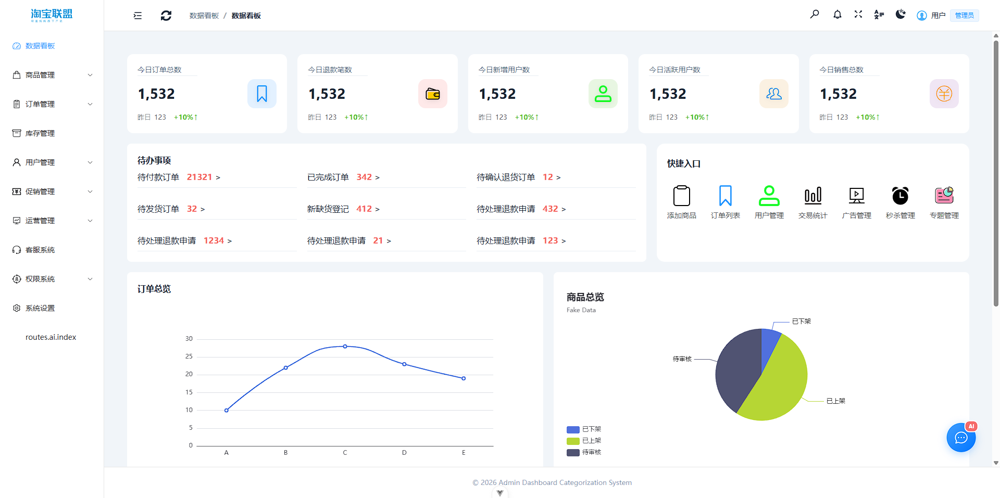
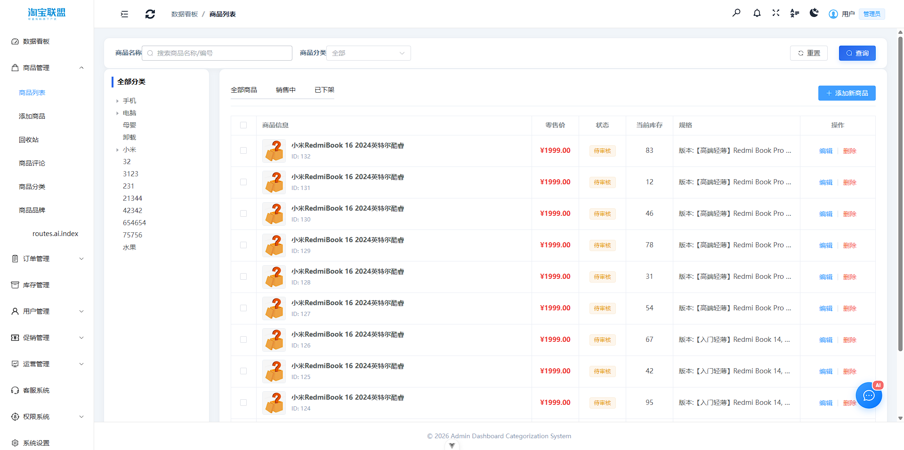
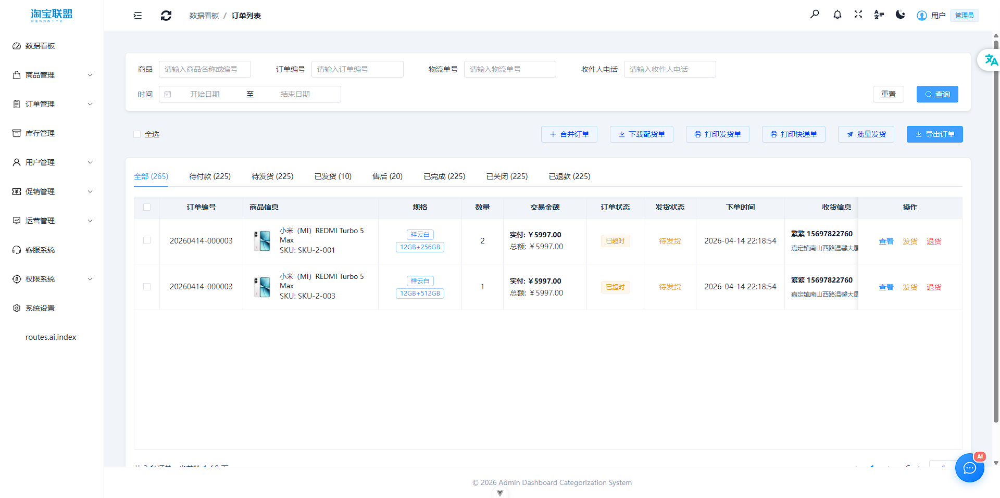
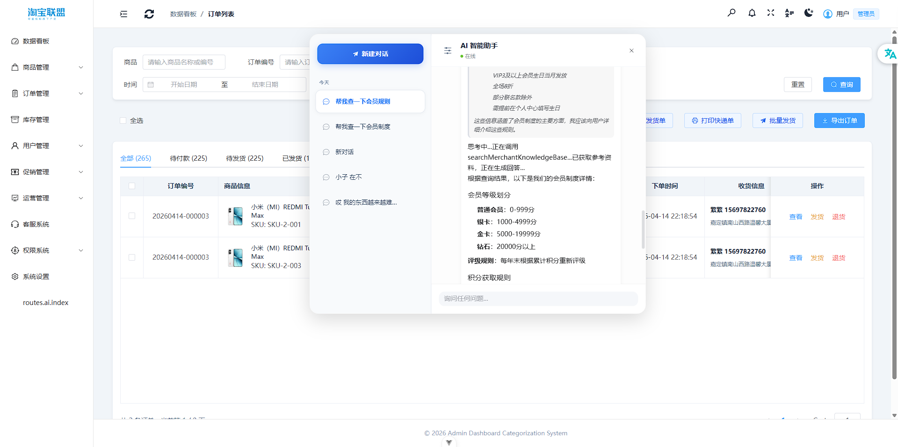

# New Rabbit Back

基于 [NestJS](https://nestjs.com/) 构建的电商后台服务端，集成 RAG 知识库检索与 AI Agent 智能对话能力。

---

## 项目简介

本项目为电商后台管理系统提供 API 服务，核心能力包括：

- **AI 智能对话** — 基于 Agent 架构，模型自主决策是否调用知识库或业务工具
- **RAG 知识库检索** — 支持商户自定义知识库（PDF、Excel、CSV、Word、TXT），向量检索 + 重排序精排
- **持久化会话记忆** — Redis 缓存 + MySQL 持久化，支持多轮对话上下文
- **多角色适配** — 商家后台、用户端、管理员三端助手，各端业务规则隔离

---

> **声明**：本项目为 Demo 级别，主要用于学习和实践 AI 应用开发，不作为生产环境使用。

---

## 核心特性

- **AI Agent 智能对话** — 基于 ReAct 架构，模型自主决策是否调用知识库或业务工具
- **RAG 知识库检索** — 支持商户自定义知识库（PDF、Excel、CSV、Word、TXT），Embedding 向量检索
- **重排序精排（Rerank）** — 向量召回后通过重排序模型二次精排，提升检索准确率与相关性
- **查询改写（Query Expansion）** — LLM 自动生成同义查询，解决字面不同导致的漏召问题
- **持久化会话记忆** — Redis 缓存 + MySQL 持久化，支持多轮对话上下文
- **多角色适配** — 商家后台、用户端、管理员三端助手，各端业务规则隔离

---

## 配套前端

前端管理后台基于 Vue 3 构建，源码地址：

[https://gitee.com/huang-xin-nan/mall-backend-management](https://gitee.com/huang-xin-nan/mall-backend-management)

### 界面预览

<p align="center">
  
  
</p>

<p align="center">
  
  
</p>

---

## 技术栈

| 层级 | 技术 |
|------|------|
| 框架 | NestJS + TypeScript |
| 数据库 | MySQL (TypeORM) |
| 缓存 | Redis |
| 向量库 | ChromaDB |
| 消息队列 | BullMQ (Redis) |
| 大模型 | OpenAI 兼容接口（支持 GLM、DeepSeek 等） |
| 向量模型 | 支持多厂商 Embedding 服务 |

---

## 快速启动

```bash
# 安装依赖
$ pnpm install

# 配置环境变量
$ cp .env.example .env
# 编辑 .env 填写数据库、Redis、ChromaDB、模型 API Key 等配置

# 开发模式
$ pnpm run start:dev

# 生产模式
$ pnpm run build
$ pnpm run start:prod
```

---

## 核心模块

| 模块 | 说明 |
|------|------|
| `langchain` | AI 对话、Agent 推理、RAG 检索、Embedding 服务 |
| `modules/merchant` | 商户管理 |
| `modules/knowledge-base` | 知识库上传、解析、向量化入库 |
| `modules/qiniu` | 七牛云文件存储 |
| `modules/auth` | JWT 认证与权限控制 |

---

## 文档

- [Agent 流式对话接口文档](./docs/agent-streaming-api.md)
- [RAG 追踪与可观测性](./docs/trace追踪.md)
- [分批入库说明](./docs/分批入库.md)

---

## License

[MIT](LICENSE)
