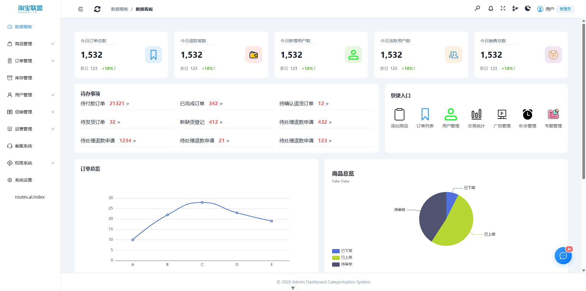
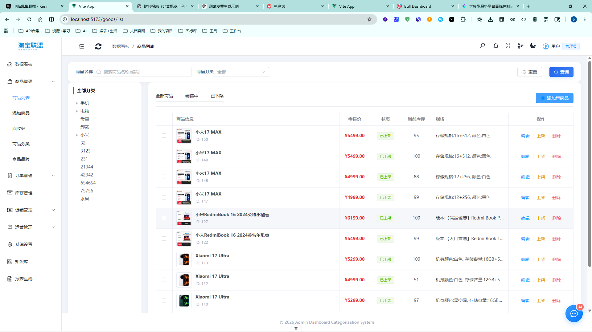
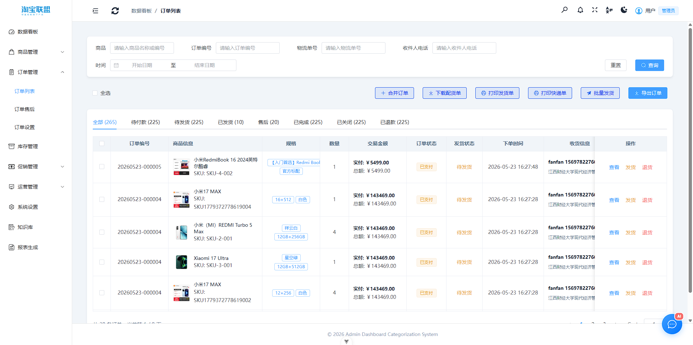
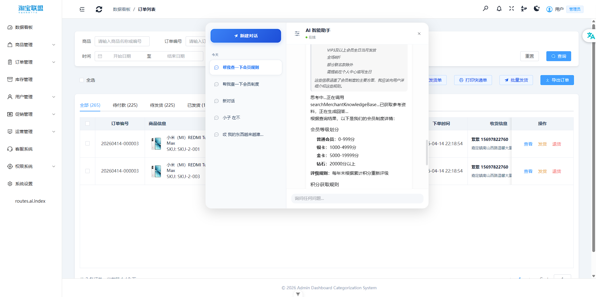
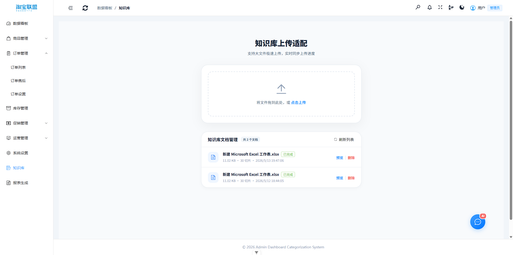
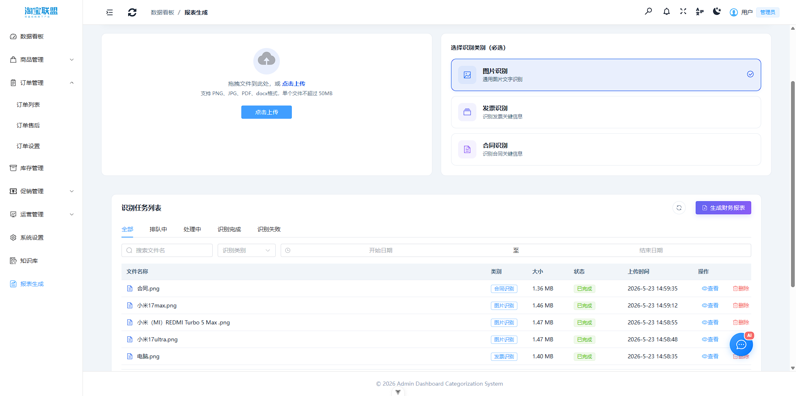
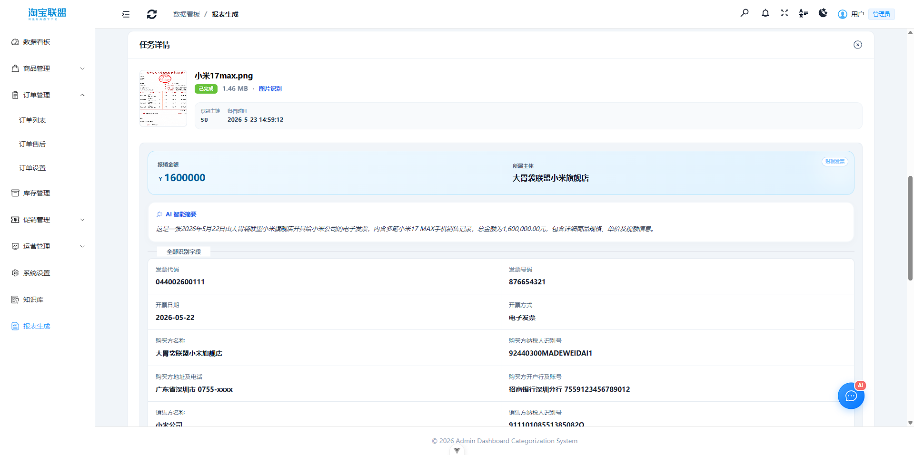
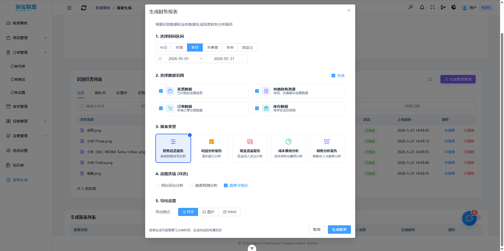
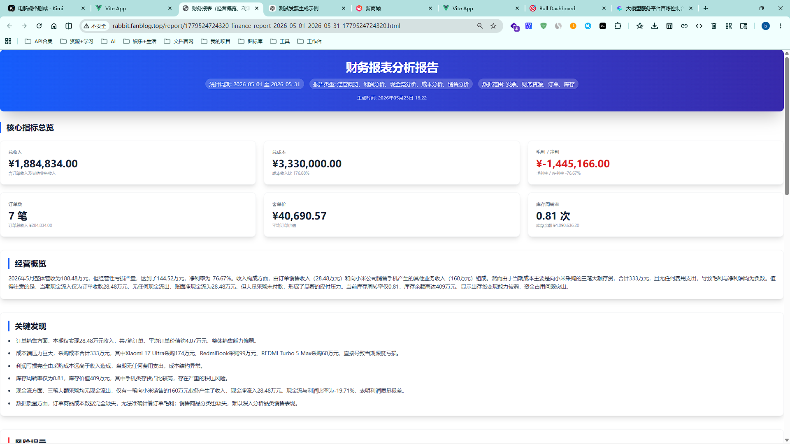

# New Rabbit Back

基于 [NestJS](https://nestjs.com/) 的电商后台服务端，深度集成 **AI Agent 智能对话**、**RAG 知识库检索**、**财务文档 OCR 识别** 与 **AI 财务报表自动生成**。

---

## 项目概述

本项目是一个功能完整的电商后台管理系统后端，覆盖商品、订单、库存、商户、用户、优惠券等常规电商业务，同时深度融合 AI 能力，实现三大智能化场景：

- **AI 智能客服** — 基于 LangGraph ReAct Agent 架构的多角色对话助手，模型自主决策调用知识库或业务工具
- **财务文档智能识别** — 上传发票/合同/通用图片，通过视觉模型 + OCR 自动提取结构化财务字段
- **AI 财务报表自动生成** — 7 步 LangGraph 流水线，从数据采集到 LLM 计算指标、生成叙事分析，最终渲染为带 ECharts 图表的 PDF 报表

---

## 核心特性

### AI 智能对话

- **ReAct Agent 架构** — 模型自主推理→决策→调用工具→观察结果→继续推理的循环模式
- **多角色适配** — 商家后台、用户端、管理员三端助手，各端工具集和业务规则隔离
- **流式输出（SSE）** — 实时推送 Agent 思考链和最终回复，支持中断恢复
- **持久化记忆** — Redis 缓存 + PostgreSQL 持久化 Checkpointer，支持多轮对话上下文与历史回溯
- **动态工具调用** — Agent 可调用商品查询、订单查询、库存查询、发货、知识库检索等业务工具

### RAG 知识库检索

- **多格式文档支持** — PDF、Excel、CSV、Word、TXT 文档上传后自动分块、向量化入库
- **向量检索 + Rerank 重排序** — ChromaDB 向量粗召回 → 重排序模型精排，提升检索准确率
- **查询改写** — LLM 自动生成多角度同义查询，解决字面不匹配导致的漏召
- **商户隔离** — 知识库按商户维度隔离，不同商户之间知识库互相不可见

### 财务文档 OCR 识别

- **多类型文档** — 支持发票、合同、通用财务图片的智能解析
- **双模型策略** — 视觉模型（图片理解）+ 腾讯云 OCR（发票专用），根据文档类型自动切换
- **LangGraph 流水线** — 文档下载→归一化→模型提取→日期解析→多文档合并→持久化，全流程可视化追踪
- **结构化输出** — OCR/视觉结果自动提取为 structured_fields 结构化字段（金额、买卖方、日期、发票号等）

### AI 财务报表自动生成

- **7 步 LangGraph 流水线** — 请求校验→数据采集→数据归一化→LLM 计算指标→LLM 叙事分析→LLM 生成 HTML→Playwright 渲染 PDF
- **LLM 全量计算指标** — 不硬编码计算公式，LLM 自主理解数据语义后个性化计算收入/成本/毛利/净利/现金流/库存周转等指标
- **智能叙事分析** — LLM 根据指标数据生成经营概览、关键发现、对比分析、风险提示、经营建议等专业财务解读
- **ECharts 可视化图表** — 自动生成销售排行、现金流走势、成本结构等图表
- **SSE 进度推送** — 实时反馈报表生成进度（数据采集→归一化→指标计算→叙事→渲染→导出）
- **多格式导出** — 支持 PDF（Playwright 渲染）、HTML 原始文件，导出后自动上传七牛云

---

## 技术栈

| 层级 | 技术选型 |
|------|----------|
| **后端框架** | NestJS 11 + TypeScript 5 |
| **数据库** | MySQL + TypeORM（业务数据）, PostgreSQL（LangGraph Checkpointer） |
| **缓存 & 队列** | Redis + BullMQ（异步任务调度：文档解析、知识入库、报表生成） |
| **向量数据库** | ChromaDB |
| **大模型** | OpenAI 兼容接口（支持 GLM、DeepSeek 等） |
| **AI 框架** | LangChain + LangGraph（Agent 编排、报表流水线、文档提取流水线） |
| **向量模型** | BAAI/bge-m3（多厂商 Embedding 服务兼容） |
| **OCR** | 腾讯云 OCR SDK + 视觉模型 |
| **PDF 渲染** | Playwright（Chromium headless） |
| **文件存储** | 七牛云 Kodo |
| **包管理** | pnpm |
| **代码规范** | ESLint 9 + Prettier |

---

## 快速启动

### 环境依赖

- Node.js >= 20
- pnpm >= 9
- MySQL 8.0+
- PostgreSQL 16（LangGraph Checkpointer）
- Redis 7+
- ChromaDB

### Docker 启动基础设施

```bash
docker compose up -d
# 启动 PostgreSQL + ChromaDB
```

### 安装与运行

```bash
# 安装依赖
pnpm install

# 配置环境变量
cp .env.example .env
# 编辑 .env 填写数据库、Redis、ChromaDB、各模型 API Key 等配置

# 开发模式
pnpm start:dev

# 生产构建
pnpm build
pnpm start:prod
```

---

## 项目架构

```
new-rabbit-back/
├── src/
│   ├── modules/                  # 20 个业务模块
│   │   ├── auth/                 # JWT 认证与权限守卫
│   │   ├── merchant/             # 商户管理
│   │   ├── user/                 # 用户管理（bcrypt 加密）
│   │   ├── role/                 # RBAC 角色权限
│   │   ├── menu/                 # 菜单权限树
│   │   ├── admin/                # 管理员数据面板
│   │   │
│   │   ├── goods/                # 商品管理（SPU/SKU/分类/品牌/规格）
│   │   ├── order/                # 订单系统（含超时自动取消）
│   │   ├── inventory/            # 库存管理（含库存变动日志）
│   │   ├── coupon/               # 优惠券系统
│   │   ├── address/              # 地址管理（省市区级联）
│   │   ├── clientHome/           # C 端首页（轮播/分类/推荐）
│   │   │
│   │   ├── finance/              # 财务文档管理（上传/OCR/视觉解析）
│   │   ├── reports/              # 报表生成入口（触发 LangGraph 流水线）
│   │   ├── report-render/        # Playwright PDF 渲染
│   │   │
│   │   ├── knowledge-base/       # 知识库（文档上传/向量化入库）
│   │   ├── qiniu/                # 七牛云文件存储
│   │   ├── email/                # 邮件发送
│   │   ├── db/redis/             # Redis 服务封装
│   │   ├── db/seed/              # 种子数据初始化
│   │   └── customization/        # 自定义配置
│   │
│   ├── langchain/                # AI 能力核心
│   │   ├── agents/               # Agent 模块（ReAct 编排、SSE 流式接口）
│   │   │   ├── factories/        # 工具工厂（按角色组装工具集）
│   │   │   └── runners/          # LangGraph Agent 运行器
│   │   │
│   │   ├── graph/                # LangGraph 工作流
│   │   │   ├── agent/            # Agent 对话图（ReAct 模式）
│   │   │   ├── vision/           # 视觉文档提取图（6 步流水线）
│   │   │   ├── reports/          # 财务报表生成图（7 步流水线）
│   │   │   │   ├── nodes/        # 7 个流水线节点
│   │   │   │   ├── prompts/      # LLM 提示词模板
│   │   │   │   ├── schemas/      # Zod 数据校验
│   │   │   │   └── utils/        # 图表/HTML/叙事工具
│   │   │   ├── nodes/            # 通用图节点
│   │   │   └── edges/            # 条件边
│   │   │
│   │   ├── rag/                  # RAG 检索
│   │   │   ├── rag.service.ts        # 向量检索 + Rerank 重排序
│   │   │   └── merchant-rag/         # 商户知识库（文档分块/向量化入库）
│   │   │
│   │   ├── tools/                # Agent 工具集（9 个业务工具）
│   │   ├── prompts/              # Agent 系统提示词
│   │   ├── persistence/          # LangGraph 持久化（PG Checkpointer）
│   │   ├── entities/             # 会话 & 消息实体
│   │   └── model-provider/       # 多模型实例管理
│   │
│   └── types/                    # TypeScript 类型定义
│
├── docs/                         # 文档与调试日志
├── images/                       # 界面截图
├── docker-compose.yml            # Docker 基础设施编排
├── pnpm-workspace.yaml           # pnpm monorepo 配置
└── package.json
```

---

## 财务报表生成流水线

```
START
  │
  ▼
[01] 验证请求参数         ← 校验日期范围、报告类型、用户权限
  │
  ▼
[02] 采集原始数据         ← 从 DB 拉取订单、库存、财务提取记录
  │
  ▼
[03] 归一化数据           ← 统一定单收入/成本/销售分类/商品/库存/现金流格式
  │
  ▼
[04] LLM 计算指标         ← AI 自主理解数据 → 计算总收入/毛利/净利/现金流/库存等指标
  │
  ▼
[05] LLM 生成叙事         ← AI 生成经营概览、关键发现、对比分析、风险提示、经营建议
  │
  ▼
[06] LLM 生成 HTML        ← AI 生成带 ECharts 图表的完整 HTML 报表页面
  │
  ▼
[07] 导出报表             ← Playwright 渲染 → PDF → 上传七牛云
  │
  ▼
 END
```

报表支持对比分析模式（同比/环比），LLM 在计算指标和生成叙事时会自动带上变化率和变化额。

---

## 业务模块概览

| 模块 | 核心职责 |
|------|----------|
| `auth` | JWT 登录认证，全局路由守卫 |
| `merchant` | 商户 CRUD，全链条数据查询（商品/订单/库存/财务） |
| `user` | 用户管理，bcrypt 密码加密 |
| `goods` | SPU/SKU 商品体系，分类、品牌、规格管理 |
| `order` | 订单创建/查询/状态流转，超时自动取消调度 |
| `inventory` | 库存查询/变更，Redis 库存缓存，库存变动日志 |
| `coupon` | 优惠券模板管理，用户优惠券发放领取 |
| `finance` | 财务文档上传，OCR/视觉解析，结构化字段提取与持久化 |
| `reports` | 报表生成入口，BullMQ 异步调度，SSE 进度推送 |
| `report-render` | Playwright Chromium headless HTML→PDF 渲染 |
| `knowledge-base` | 知识文档上传，异步向量化入库 ChromaDB |
| `qiniu` | 七牛云文件上传/下载 |
| `clientHome` | C 端首页数据（轮播图/分类/商品推荐），Redis 缓存 |

---

## AI 能力全景

```
┌─────────────────────────────────────────────────┐
│                   AI 能力矩阵                      │
├───────────────┬───────────────┬─────────────────┤
│  智能对话      │  文档识别      │  报表生成         │
│  (Agent)      │  (Vision)     │  (Reports)       │
├───────────────┼───────────────┼─────────────────┤
│ ReAct 推理    │ 视觉模型理解   │ LLM 全量计算指标  │
│ 动态工具调用   │ 腾讯云 OCR    │ AI 叙事分析       │
│ 流式 SSE 输出  │ 多文档合并    │ ECharts 图表      │
│ 多角色适配    │ 字段归一化    │ Playwright PDF   │
│ 知识库检索    │ 日期自动解析   │ SSE 进度推送     │
│ Rerank 重排序 │ 结构化输出    │ 同比环比对比      │
│ 查询改写       │ 持久化存储    │ 七牛云导出       │
└───────────────┴───────────────┴─────────────────┘
```

---

## 界面预览

<p align="center">
  
  
  
</p>

<p align="center">
  
  
  
</p>

<p align="center">
  
  
  
</p>

---

## 配套前端

前端管理后台基于 Vue 3 构建，源码地址：

[https://gitee.com/huang-xin-nan/mall-backend-management](https://gitee.com/huang-xin-nan/mall-backend-management)

---

## 文档

- [Agent 流式对话接口文档](./docs/agent-streaming-api.md)
- [RAG 追踪与可观测性](./docs/trace追踪.md)
- [分批入库说明](./docs/分批入库.md)

---

## License

[MIT](LICENSE)
